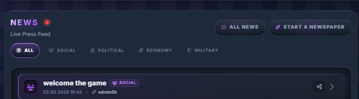
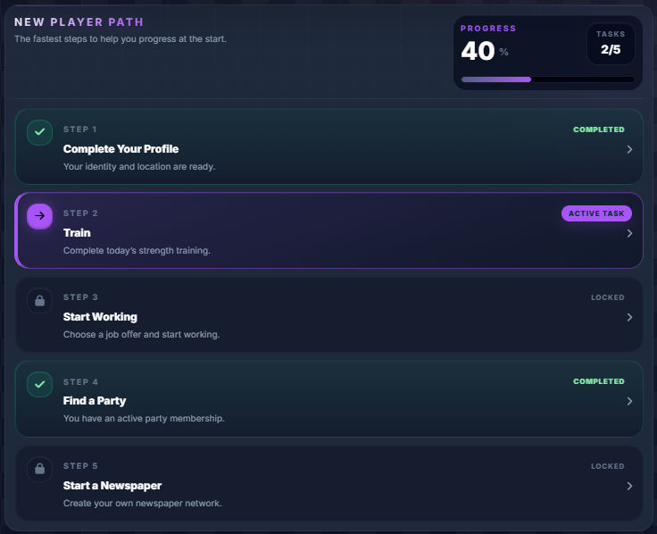
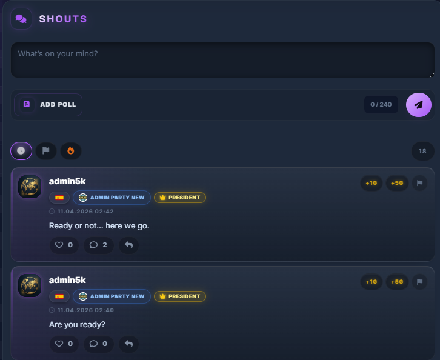
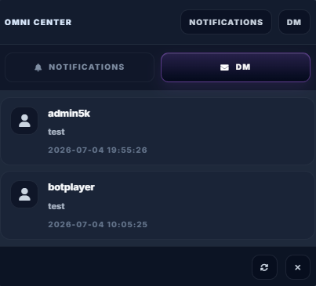
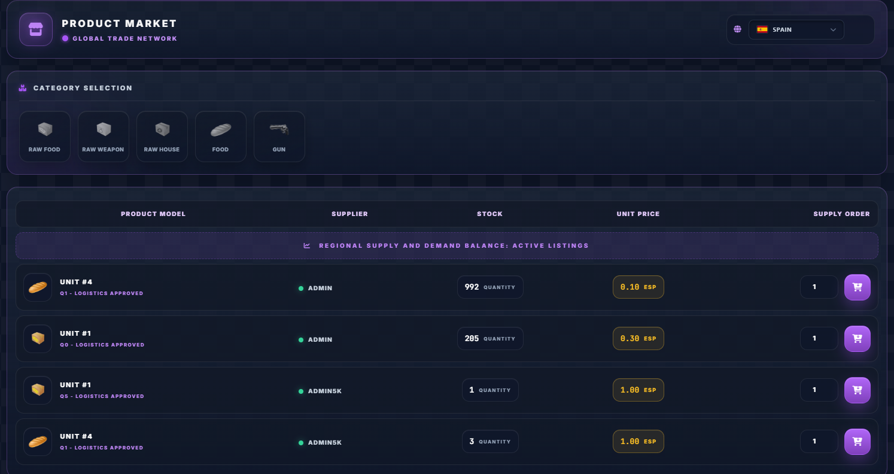
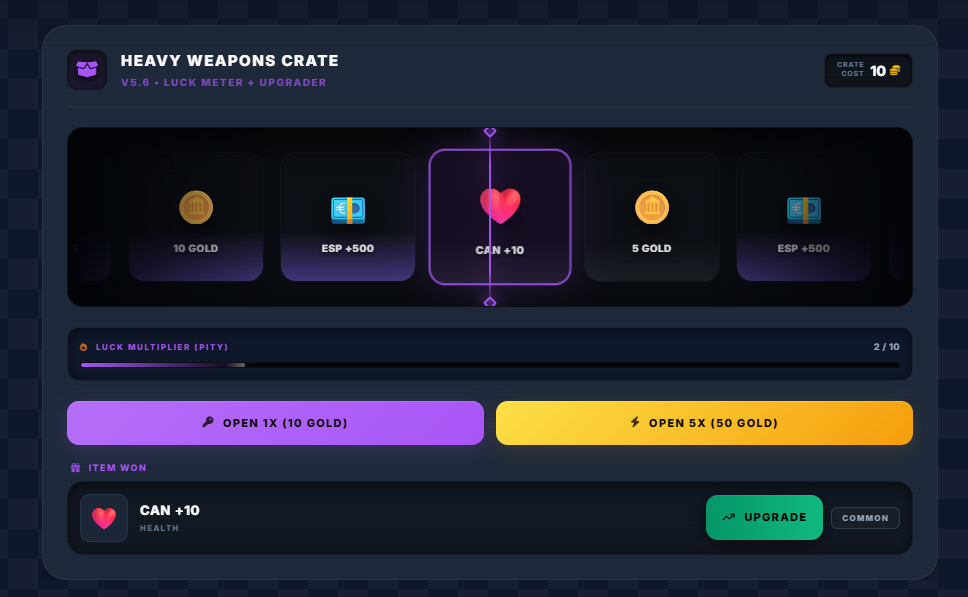
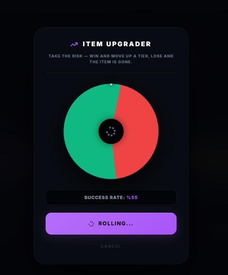

# Project V26


Project V26 is a browser-based political strategy and social simulation game built with PHP, Slim and Twig. The project focuses on a public, playable web experience where players manage identity, resources, communication, news and community-driven progression.

> Public build note: this repository is prepared for open source review and contribution. Private production secrets, local database dumps and runtime files must not be committed.

## What Is Project V26?

Project V26 is a web game inspired by nation, economy and community systems. It combines player progression, messaging, newspapers, public shouts, onboarding goals and dashboard-style game management in a single interface.

## Game Goal

Players grow their profile, interact with other players, follow public news, manage resources and take part in the wider game world. The main objective is to create a living social strategy environment where player actions, communication and public content shape the experience.

## Features

- Player dashboard with quick actions and resource status.
- News and newspaper flow with categories and sharing.
- Shouts feed for public player communication.
- Direct messages and privacy-oriented settings.
- User settings for profile, security, theme, language and game experience.
- Onboarding route for new players.
- Admin/system notice support for important game announcements.
- Docker-friendly local development setup.

## UI Preview

### Main Navigation

Main navigation and favorite quick-access actions.


### News and Onboarding

News feed, category filters and new player route.





### Community

Public shouts feed and notification/DM center.





### Market and Economy

Product market and economy modules.



### Crate and Upgrade Systems

Crate opening and item upgrade interfaces.





## Tech Stack

- PHP 8.0 runtime image for Docker.
- Slim 3 application structure.
- Twig templates.
- Illuminate Database components.
- Apache with rewrite support.
- MySQL/MariaDB compatible database layer.
- Legacy Grunt/Sass asset tooling.

## Docker Setup

Requirements:

- Docker Desktop
- Git
- Composer, only if you install dependencies outside Docker

Build and run a local container from the project directory:

```bash
docker build -t project-v26 .
docker run --rm -p 8080:80 --env-file .env project-v26
```

Then open:

```text
http://localhost:8080
```

If your local environment uses a separate Docker Compose file, keep it outside committed secrets and document local-only overrides separately.

## Local Setup

1. Clone the repository.
2. Copy `.env.example` to `.env`.
3. Fill in local database values.
4. Install PHP dependencies if your environment does not mount an existing `vendor` directory:

```bash
composer install
```

5. Start the app with Docker or your local Apache/PHP setup.
6. Import a development database only from a safe local dump. Do not commit dumps such as `db.sql`.

## Project Structure

```text
app/                 Application controllers, services and system helpers
templates/           Twig views
lang/                Translation files
public assets        Images, CSS/JS assets depending on local layout
.docker/             Docker Apache/PHP configuration
Dockerfile           PHP/Apache development image
composer.json        PHP dependencies
package.json         Legacy frontend tooling metadata
```

## Roadmap

See [ROADMAP.md](ROADMAP.md) for the current public roadmap.

Near-term focus:

- Stabilize public onboarding and main dashboard UX.
- Improve message, notification and privacy settings.
- Continue separating real backend-supported settings from planned features.
- Prepare safer development fixtures and setup documentation.

## Contributing

Contributions are welcome when they are small, reviewable and aligned with the current architecture. Before opening a pull request, read [CONTRIBUTING.md](CONTRIBUTING.md).

Recommended contribution style:

- Keep changes scoped.
- Avoid committing secrets, dumps or generated dependencies.
- Prefer existing Slim/Twig patterns.
- Include screenshots for UI changes when possible.

## Security

Please do not open public issues for vulnerabilities. See [SECURITY.md](SECURITY.md) for responsible reporting guidance.

## Content Creation / Public Build

Creators may use the public build for videos, streams, screenshots and educational walkthroughs as long as private server credentials, player private data and unpublished admin-only workflows are not exposed.

When sharing public content:

- Use local/demo data where possible.
- Blur private messages, tokens and admin-only screens.
- Mention that the project is in active development.

## License

This project currently includes an MIT license. See [LICENSE](LICENSE).
